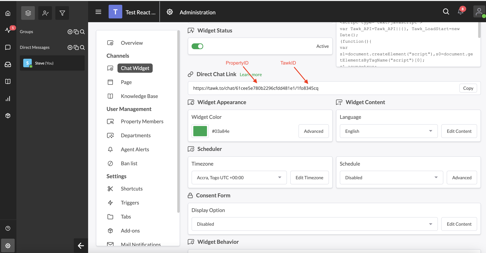

# tawkto-react

A simple wrapper around tawk.to JS API to help integrate chat into any application that is based on the react framework

## Installation

```sh
npm install tawkto-react --save
```

## Usage

This package is simple react wrapper around the tawk.to JS API. Explore the [Tawk JS API](https://developer.tawk.to/jsapi/) as you wish.

Please consider migrating to the latest version and fetch the `propertyId` and  `tawkId` from your account




## class component

```javascript
import TawkTo from 'tawkto-react'

componentDidMount()
{
    var tawk = new TawkTo(propertyId, tawkId)

    tawk.hideWidget()
}
```

## functional component

```javascript
import TawkTo from 'tawkto-react'

useEffect(() => {
    
    var tawk = new TawkTo(propertyId, tawkId)

    tawk.onStatusChange((status) => 
    {
        // console.log(status)
    })

}, [])
```

## License
[MIT](LICENSE)

## Authors

* **Steve Junior**


